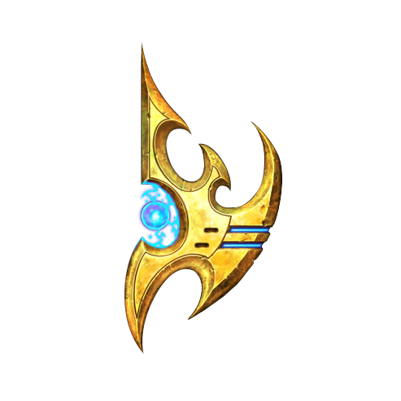

# StarCraft II Quarkus Agent — Day Zero

**Date:** 2026-04-06
**Type:** day-zero



---

## What I was trying to achieve: a living testbed for the technology I care about

I've been building CaseHub — a Blackboard/CMMN framework for Quarkus — and it's reached the stage where I need something demanding to build against. Not a toy. Not a contrived demo. Something that requires real reasoning, real time pressure, and enough complexity that you can't fake your way through it.

StarCraft II fit. The game is old enough to be stable. It's complex enough to demand genuine intelligence. And it has a Java API I could use without rewriting everything from scratch.

The more I thought about it, the more it made sense — not just for CaseHub, but for Drools and Quarkus Flow too. Three systems I want to evolve, one demanding domain to test them in.

## The paper that shaped the skeleton

I found a 2010 AAAI paper — "Applying Goal-Driven Autonomy to StarCraft" by Weber and Mateas. It described EISBot, a Protoss bot using a GDA control loop: Discrepancy Detector → Explanation Generator → Goal Formulator → three managers for Strategy, Income, Tactics. 73% win rate against the built-in AI.

I wasn't going to reimplement it. But the four concerns — strategy, economics, tactics, scouting — were exactly the right seams for plugin boundaries. What the bot *did* mattered less than what it was *organised around*.

## Four levels, not one

I brought Claude in for the architecture. The obvious version — one plugin per concern — wasn't enough. I needed plugins that could observe other plugins, direct the engine's behaviour, react to the full blackboard. That meant four levels, not one seam type:

- Frame Observer — raw SC2 observations, every tick
- CaseFile Reactor — watches the full blackboard via `onChange()`
- PlanningStrategy — controls what the CaseEngine runs next
- TaskDefinition / Worker — the named seams for strategy, economics, tactics, scouting

The shared substrate runs through all of them. A Drools plugin watching the blackboard at Level 2, a CMMN PlanningStrategy directing the CaseEngine at Level 3, a Quarkus Flow Worker at Level 4 — all coexisting in the same running system. CaseHub owns the lifecycle; everything else is a plugin.

We went through several diagram iterations before it clicked. The key question was whether CaseFile and IntentQueue were active components or passive shared state. They're passive. The boxes around them do the work.

The four named plugin seams — the extension points where Drools, Quarkus Flow, or CaseHub implementations will eventually slot in — each come down to a single line:

```java
public interface StrategyTask  extends TaskDefinition {}
public interface EconomicsTask extends TaskDefinition {}
public interface TacticsTask   extends TaskDefinition {}
public interface ScoutingTask  extends TaskDefinition {}
```

That's the whole contract. Swap an implementation by providing a new `@ApplicationScoped @CaseType("starcraft-game")` bean. Nothing else changes.

## Mock first, SC2 second

Claude proposed building the full architecture against a stateful mock before touching a real SC2 install. I hadn't planned it that way, but it was obviously right.

The mock — `SimulatedGame` — would behave like a real game: receive intents, mutate state, produce observations. When real SC2 surprised us, we'd update the mock to replicate the quirk and write a test. The mock becomes a specification, not just a stand-in.

I also picked Protoss early. Simplest production model — no Zerg larva mechanics, no Terran floating buildings. The domain model starts small.

The native Quarkus question surfaced in the design too. I want this running native eventually, but I've been burned before by blocking progress on it. The policy: native is the goal, non-native parts are acceptable if they're self-contained, decoupled, and tracked. That's CLAUDE.md now.

Phase 0 was the scaffold. Phase 1 is real SC2.
