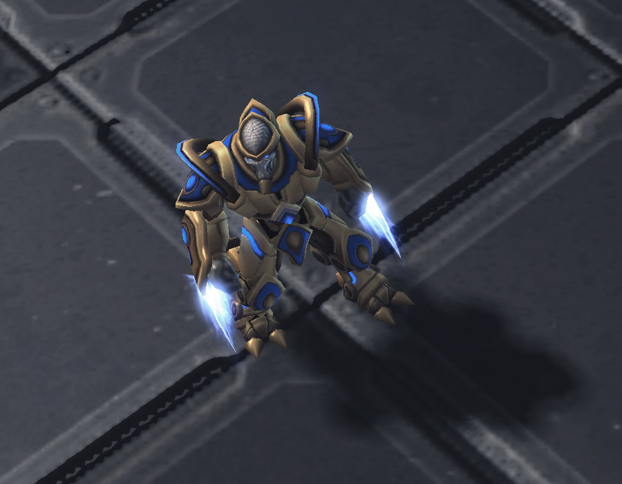
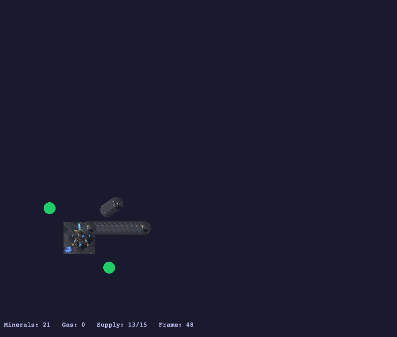

# The Game Has Stakes Now

**Date:** 2026-04-09
**Type:** phase-update

---

## Before the fight: clearing the economics bug

There was a budget bug I'd been carrying. The economics decision service was overcommitting resources every tick — hand it 110 minerals and watch it queue both a Pylon (costs 100) and a Probe (costs 50).

The cause: `EconomicsFlow` used four sequential `consume()` steps, and Quarkus Flow serialises the `GameStateTick` between them. Each step received a freshly-deserialised `ResourceBudget` with the original mineral values. The Pylon decision spent 100 minerals on its copy; the Probe decision never saw that spend.

The fix was one method: collapse all four decisions into `checkAll()`, a single step. No serialisation boundary, one budget object shared across all four checks. I wrote the test first — 110 minerals, conditions that trigger both decisions — confirmed it failed, then applied the fix. It's that kind of bug: invisible at the API level, obvious once you know where to look.

## The combat design: flat damage, Protoss shields, twenty files



I brought Claude in for E3. The design I settled on: flat damage per scheduler tick, simultaneous two-pass resolution, and shields. No attack cooldowns — at 500ms ticks they're hard to perceive and easy to get wrong. E4 can swap `damagePerTick` for per-attack events when fidelity matters.

Shields were worth adding from the start. Protoss units have them, and leaving them out would mean a domain model change later. Adding `shields` and `maxShields` to the `Unit` record touched 20 files. The compiler caught every site — but you still have to care about the right ones. `moveFriendlyUnits()` replaces each `Unit` object on every tick. Forgetting `u.shields()` and `u.maxShields()` in that replacement silently resets shields to zero every tick. The test suite wouldn't catch it; the first time you'd notice is when every Protoss unit stops having shields in the visualiser.

## The fairness problem in resolveCombat()


The interesting design decision in combat resolution is the two-pass approach. A naive sequential implementation lets unit A kill unit B before B gets to attack. SC2 doesn't work that way.

We used collect-then-apply. First pass accumulates pending damage:

```java
nearestInRange(attacker.position(), enemyUnits, SC2Data.attackRange(attacker.type()))
    .ifPresent(t -> pending.merge(t.tag(), SC2Data.damagePerTick(attacker.type()), Integer::sum));
```

Second pass applies it all at once, then removes the dead. A probe attacking a Zealot dies from the counterattack in the same tick. Both die. That's the expected outcome and it's worth getting right from the start.

## Health tinting and the Playwright proof

We added health tinting to the visualiser: full colour at high HP, yellow around the middle, red when critical. A separate Claude — running as a code-quality reviewer — caught a nuance: the tint was being set on the PixiJS `Container`, but the original sprite tint lived on the inner `Sprite` child. In PixiJS 8 these are different objects. We fixed it by writing to both.

The Playwright E2E tests close the loop. We inject a low-health probe via `SimulatedGame.setUnitHealth()`, push an observation, then assert on the sprite's `tint` property through `window.__test.sprite()`. No pixel sampling — the state is readable from the JS layer directly.

236 tests pass. Units fight. Probes die red.



*Frame 48: a Zealot has marched from (26,26) and reached the probe line. Supply dropped from 15 to 13 — two probes are already gone.*
