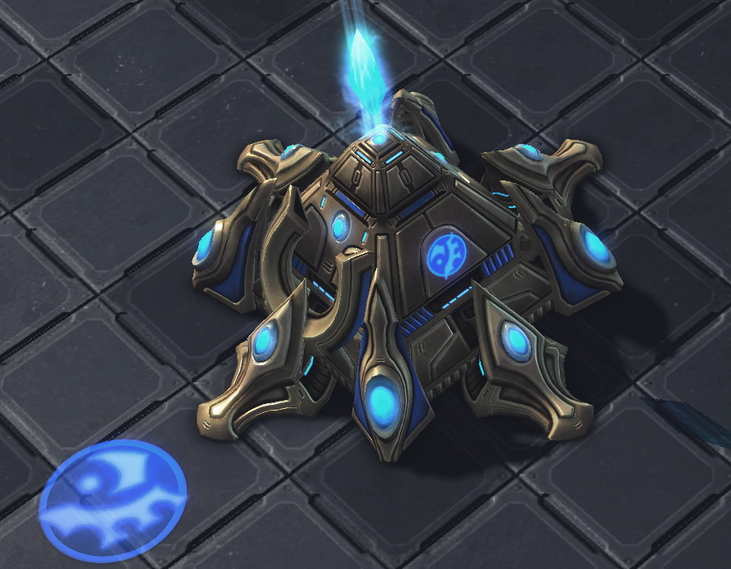
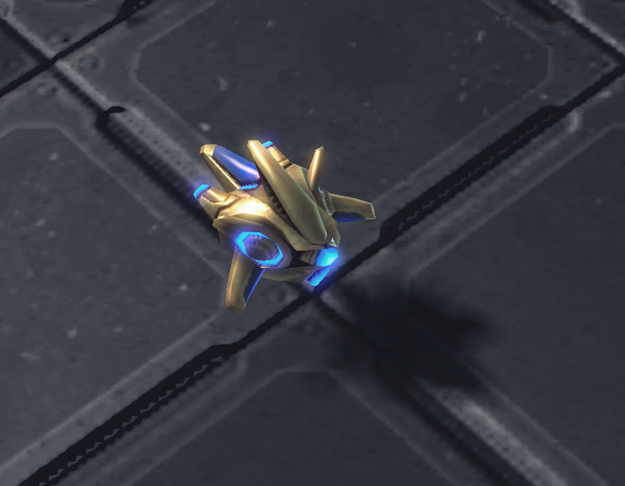
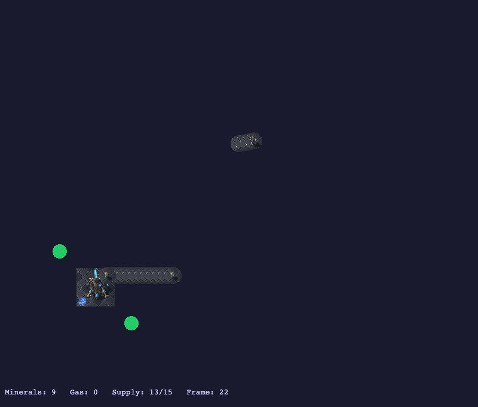

# Watching the Game Without Playing It

**Date:** 2026-04-09
**Type:** phase-update

---

## Why I built an emulator

No live SC2 binary. No immediate path to get one. The bot could reason about StarCraft II and dispatch commands — but to test that against anything real, I needed SC2 running. Rather than wait, I decided to build a physics simulation to connect to instead.

The key architectural constraint: keep `SimulatedGame` untouched. It's the scripted test oracle for unit tests and must stay deterministic. A new `EmulatedGame` class would do the physics. Same `SC2Engine` interface, different Quarkus profile. Running under `%emulated` gives the full agent loop — CaseHub, Drools, Flow economics, GOAP tactics, scouting — against a progressively more realistic simulation.

E1 was just mineral harvesting. Probes at their starting positions, +0.0372 minerals per probe per scheduler tick. I brought Claude in to implement the phases incrementally — we extracted the hardcoded data tables from `SimulatedGame` into a shared `SC2Data` class so both engines draw from the same source of truth.

## The visualiser



The emulator is invisible without something to look at. We built a PixiJS 8 visualiser — served as a static file by Quarkus, pushed via WebSocket on every game tick, wrapped in an Electron window. SC2 unit portraits come from a proxy endpoint that fetches them from Liquipedia server-side, resolving the WebGL CORS restriction:

```java
@GET @Path("/{name}")
public Response getSprite(@PathParam("name") String name) {
    byte[] data = cache.computeIfAbsent(name, this::fetch);
    return Response.ok(data).type("image/jpeg").build();
}
```

When I first opened the visualiser, I saw the nexus at tile (8,8), two green geyser dots, and nothing else. The twelve probes were missing.

## The mask bug



The probes existed — `window.__test.spriteCount('unit')` returned twelve. They were invisible.

We'd applied a circular mask to clip each probe portrait. Standard PixiJS 7 approach: add a `Graphics` circle as a child of the `Sprite`, set `sprite.mask`. In PixiJS 8 this makes the sprite invisible — no error, `visible=true`, `alpha=1`, renders nothing. The coordinate space between an anchored sprite and its child mask is misaligned in the WebGL renderer.

The fix: wrap the sprite in a `Container`, add both the sprite and the `Graphics` mask as siblings inside the container, apply the mask to the container instead. Documented in the knowledge garden — it will catch anyone migrating from PixiJS 7 without knowing about it.

## E2: the game moves

With a working foundation, we added movement, a scripted enemy wave, and real intent handling. `BuildIntent` and `TrainIntent` now deduct resources and complete after real build times. `MoveIntent` and `AttackIntent` set movement targets — units slide toward them each tick.

Enemy Zealots spawn at tile (26,26) at frame 200 and march toward the nexus. The config panel on the right of the canvas lets you tune the wave timing, unit count, and movement speed without restarting — a `PUT /qa/emulated/config` call backed by `EmulatedConfig`, a CDI bean with `@ConfigProperty` defaults and volatile runtime overrides for live adjustment.

The first time four red Zealot sprites started moving across the canvas toward the nexus, the emulation looked like something. Not StarCraft II, but something you could reason about.



*Four Zealots spawned at tile (26,26), advancing on the nexus. Probes clustered at their starting positions. Geysers marked in green. The HUD shows minerals accumulating.*
